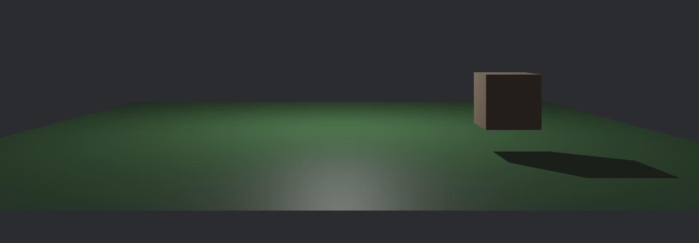

# GuGu

My poor attempt at learning Bevy game development in 3D.

## Goals

- [x] Basic 3D rendering
- [x] Basic 3D movement (keyboard)
- [x] Custom Bevy plugins
- [ ] Custom Bevy bundles
- [ ] Basic 3D movement (mouse)
- [ ] Basic 3D collision detection
- [ ] Camera movement
- [ ] Loading external 3D models
- [ ] Textures
- [ ] Animations
- [ ] Dynamic Lighting
