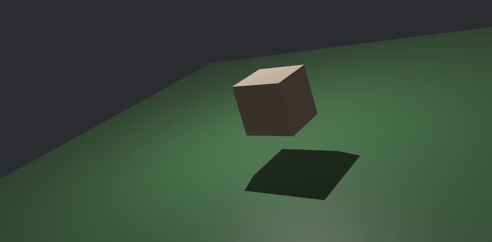

# GuGu

My poor attempt at learning Bevy game development in 3D.

## Goals

- :white_check_mark: Basic 3D rendering
- :white_check_mark: Basic 3D movement (keyboard)
- :white_check_mark: Custom Bevy plugins
- :white_check_mark: Basic 3D movement (mouse)
- :white_check_mark: Camera movement
- :white_check_mark: Grab the mouse cursor for the window
- Combine grabbing the mouse cursor with camera movement
- Custom Bevy bundles
- Basic 3D collision detection
- Loading external 3D models
- Textures
- Animations
- Dynamic Lighting
